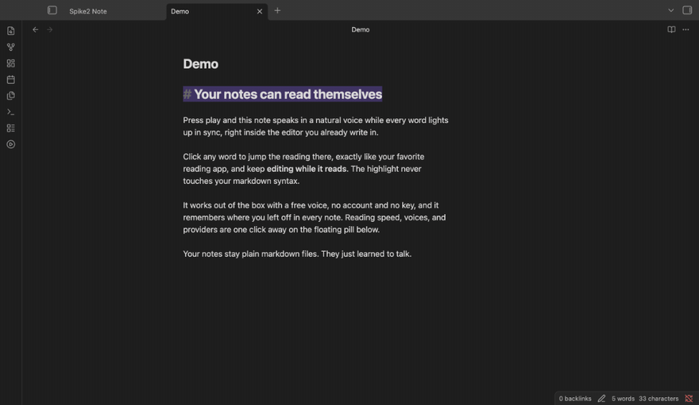

# Speaking Editor

**Read your notes aloud, right inside the Obsidian editor.** Speaking Editor is a text to speech read-aloud reader for Obsidian: press play and your note speaks itself in a natural voice while the current word highlights and the view follows along. Click any word to jump the reading there, exactly like Speechify, inside the editor you already write in. Listen to your notes with a free voice that works the moment you enable it, no account and no key.

Keywords: read aloud, text to speech, TTS, listen to your notes, Obsidian read aloud, Speechify for Obsidian, karaoke highlighting.



## What "listening mode" means (in plain words)

Speaking Editor reads inside your normal editor, so a click has to mean one of two things: move my cursor to edit, or move the reading to here. Listening mode is the switch that decides.

- **Listening mode on (the default):** while a note is being read, clicking a word jumps the reading to that word. This is the Speechify-style "tap to go here" behavior.
- **Listening mode off:** clicks edit as normal, the way Obsidian always behaves. The voice keeps reading, but your clicks move the cursor.

You toggle it in settings, from the reading pill, or with the "Toggle listening mode" command. Turn it off the moment you want to edit while listening, turn it on to steer the reading by clicking.

## Features

- **Word-by-word highlighting** synced to the audio, following along as the voice reads, in both Live Preview and Reading view.
- **Click to jump** (in listening mode): click any word and the reading continues from there.
- **A free voice out of the box**: Edge TTS gives natural neural voices with exact word timing, no key, no account.
- **Bring your own premium voice**: add an ElevenLabs key for premium voices. The key stays on your device.
- **Fully offline option on macOS**: Apple's built-in `say` voices, nothing leaves your machine.
- **Reading speed** from 0.5x to 3.0x, applied instantly to the live audio.
- **Resume where you left off**: press play on a note you stopped within the last 12 hours and it picks up from the sentence you were on (one quiet notice, no dialog). "Read this note from the top" starts over.
- **Audio cache** so a note you have heard before replays instantly and costs no API credits. The cache lives outside your vault and never syncs.
- **Your notes stay plain markdown.** The plugin reads them; it never changes where they live or what they are.

## Voice tiers

| Tier | Provider | Word timing | Key required | Notes |
|---|---|---|---|---|
| Free (default) | Edge TTS | Word-level (exact) | No | Natural neural voices, no account. Unofficial and best effort (see the disclaimer). Needs internet. |
| Offline | macOS `say` | Estimated | No | Apple's built-in voices, fully offline, nothing leaves your machine. macOS only. |
| Premium (BYOK) | ElevenLabs | Word-level (exact) | Yes | High-quality voices with your own API key, stored per device. Needs internet. |

Edge is the default on every platform because exact word sync is the whole point of Speaking Editor.

## Requirements

Speaking Editor is **desktop only** (its manifest is flagged `isDesktopOnly`). The Edge transport, the audio cache, and the macOS `say` fallback rely on Node, which Obsidian mobile does not provide. Mobile support is on the roadmap (see [BACKLOG.md](BACKLOG.md)); it needs a different transport. Minimum Obsidian version: 1.5.0.

## Quick start

1. Install the plugin (see Install, below) and enable it in **Settings -> Community plugins**.
2. Open any note.
3. Click the **play** ribbon icon (left sidebar), or run the command **"Play or pause reading"** from the command palette.
4. The note starts reading. The current word highlights and the view follows along.
5. With listening mode on, **click any word** to jump the reading there.
6. Press play again to pause, or run **"Stop reading"** to end.

That is the whole loop. Everything else is preference.

**Power use:** assign a keyboard shortcut to "Play or pause reading" under
**Settings -> Hotkeys** (search "Speaking Editor"). The plugin deliberately
ships no default hotkey, since defaults collide with everyone's existing
muscle memory; one assignment makes play/pause a reflex.

## Install

### From the Obsidian community plugin list

Once Speaking Editor is approved for the community list, install it from **Settings -> Community plugins -> Browse**, search for "Speaking Editor", install, and enable. (Approval is a follow-on step; until then, use manual install or BRAT.)

### Manual install

1. Download `main.js`, `manifest.json`, and `styles.css` from the latest [GitHub release](https://github.com/rishmadaan/speaking-editor/releases).
2. Create the folder `<your-vault>/.obsidian/plugins/speaking-editor/`.
3. Copy the three files into it.
4. Reload Obsidian, then enable Speaking Editor in **Settings -> Community plugins**.

### Build from source

```bash
git clone https://github.com/rishmadaan/speaking-editor.git
cd speaking-editor
npm install
node build.mjs --prod   # writes dist/main.js, dist/manifest.json, dist/styles.css
```

Then copy the three files from `dist/` into your vault's plugin folder as above.

## Settings guide

Open **Settings -> Speaking Editor**.

- **Voice provider** picks where the spoken audio comes from (Edge, ElevenLabs, or macOS say). Edge is free and keeps words in exact sync.
- **Voice** picks the specific voice for the chosen provider.
- **Reading speed** sets how fast to read, from 0.5x to 3.0x. Changes apply immediately to live audio.
- **Listening mode** toggles the click behavior described above.
- **[Provider] API key** appears only for a provider that needs one (ElevenLabs). Paste your key to use it; the trash button clears it. Keys are entered as a password field and are never shown back as text.
- **Audio cache size** caps how much synthesized audio is kept (50 MB, 200 MB, 500 MB, or 1 GB; default 200 MB).
- **Where it is kept** shows the exact cache directory on your machine.
- **Clear cache now** deletes the saved audio; it is rebuilt as you listen again.

### Where keys and cache live, and why

- **API keys** are stored per device in the Obsidian app's `localStorage`, never in the plugin's `data.json`. That is deliberate: `data.json` lives inside your vault and can be synced, and a synced vault must never carry a secret. The trade-off is honest: `localStorage` is per device, not an OS keychain, so entering a key on one machine does not carry it to another.
- **The audio cache** lives outside your vault, in a per-device cache directory (`~/Library/Caches/speaking-editor` on macOS, `$XDG_CACHE_HOME/speaking-editor` or `~/.cache/speaking-editor` elsewhere). Caching audio inside a vault would sync large binary files with your notes and bloat every device; keeping it out of the vault means replays are instant and free without touching your notes.

Full data-flow details are in [PRIVACY.md](PRIVACY.md).

## Edge TTS: unofficial and best effort

The default free voice uses the `msedge-tts` package to reach the same general service family as Microsoft Edge's Read Aloud. This provider is **unofficial and best effort**: it may stop working, be rate-limited, become gated, or change behavior without notice. That is exactly why the free default sits behind a provider layer with an offline fallback (macOS `say`) and a premium option (ElevenLabs). If Edge stops producing audio, switch providers in settings. Full wording is in [DISCLAIMER.md](DISCLAIMER.md).

## Troubleshooting

**Edge TTS produces no audio or a connection error.** Edge needs an internet connection and is unofficial and best effort. If you are offline or Edge is being disrupted, switch to macOS `say` (offline) or ElevenLabs in settings.

**macOS say is not in the provider list.** The `say` provider only works on macOS. On other platforms it is hidden.

**ElevenLabs returns an error.** Confirm the API key is pasted correctly in settings. ElevenLabs free accounts may be blocked from the TTS API; a paid plan is recommended for API access.

**The first read of a long note is slow.** Audio is synthesized in chunks as you read, and later chunks are prefetched. Once a chunk is cached, replaying it is instant and costs no API credits.

**The highlight looks off after I edit the note.** Editing while reading can make the reading model stale. Stop and start again to re-read from a clean state.

**Reading stopped when I switched between editing and reading view.** Flipping a note between Live Preview and Reading view ends the active session by design in this version. Press play again to restart in the new view. (Cross-view continuity is on the roadmap.)

**A very long note in Reading view is not highlighting.** Reading view can virtualize (unload) offscreen text in long notes, which this version cannot align against, so it fails safe to no highlight rather than a wrong one. Live Preview is unaffected. This is a known limit on the roadmap.

## Commands

| Command | What it does |
|---|---|
| Play or pause reading | Start reading the active note, or pause/resume it |
| Stop reading | Stop the current reading session |
| Read this note from the top | Clear the saved spot and read from the beginning |
| Toggle listening mode | Switch click-to-jump on or off |

The play ribbon icon in the left sidebar mirrors "Play or pause reading".

## Attribution

Speaking Editor's engine (text extraction, provider adapters, timing normalization, voice and audio caching, playback) was vendored from **[TalkToMeBaby](https://github.com/rishmadaan/talktomebaby)**, a read-aloud extension for VS Code by the same author, and evolved here for Obsidian. See [VENDOR.md](VENDOR.md) for what was reused and [THIRD_PARTY_NOTICES.md](THIRD_PARTY_NOTICES.md) for full third-party notices.

Speaking Editor is independent and is not affiliated with, endorsed by, or sponsored by Speechify, Obsidian, Microsoft, or ElevenLabs.

## License

[MIT](LICENSE), Copyright (c) 2026 Rishabh Madaan. Additional disclaimers are in [DISCLAIMER.md](DISCLAIMER.md); privacy and data-flow details are in [PRIVACY.md](PRIVACY.md); third-party notices are in [THIRD_PARTY_NOTICES.md](THIRD_PARTY_NOTICES.md).
